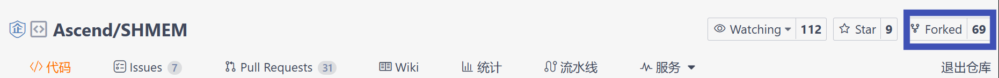
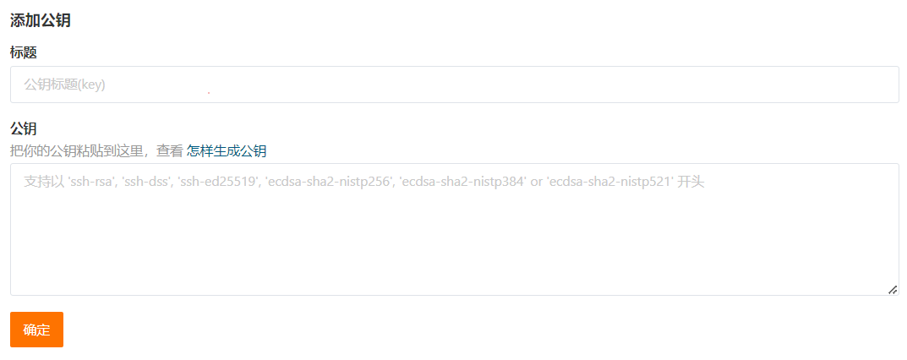
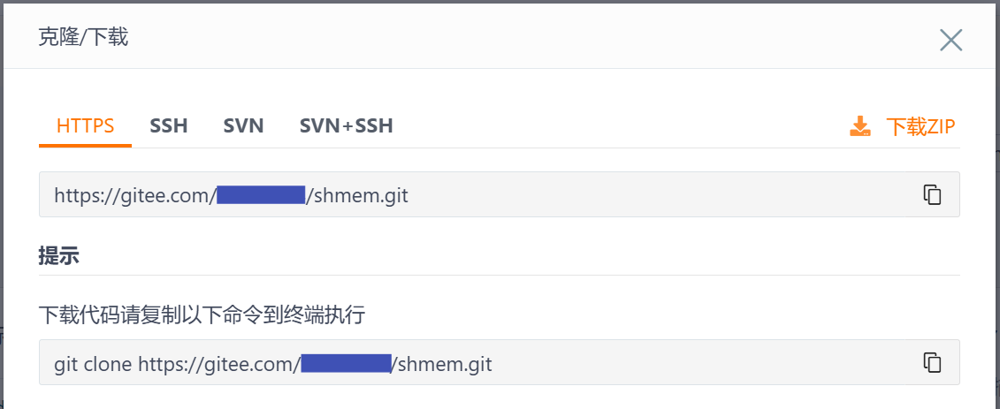

# Gitee 工作流说明

### 1. 开展工作流前的准备

- 安装Git：请先确保您的电脑上已经安装了Git软件。如您需了解GIt，可以在Google、baidu或其他搜索引擎上求助相关内容。
- 在开展Gitee的工作流之前，您需要先在Ascend的代码托管平台的上找到您感兴趣的Repository。如果您还未找到对应的Repository，请参考[体验CANN开放项目](../README.md/#体验CANN开放项目)。


### 2. 准备本地代码

#### 2.1 Fork个人分支

1)  找到并打开对应的开放项目的首页
2)  点击右上角的 `Fork` 按钮，按照指引，建立一个属于"**个人**"的云上fork分支。

     

#### 2.2 把fork分支克隆到本地

请按照以下的复制过程将repository内的代码下载到您的在计算机上。

1）**创建本地工作目录**：

您需要创建本地工作目录，以便于本地代码的查找和管理

```
mkdir ${your_working_dir}
```

2）**完成git上用户名和邮箱的全局配置**（如果您之前已经完成过此项配置，请忽略）

把git上的 `user` 设置成您gitee的个人名称：

```
git config --global user.name "your Gitee Name"
```

配置您的git邮箱

```
git config --global user.mail "email@your_Gitee_email"
```

3）**完成SSH公钥注册（如果您没有完成此注册，每次都要重新输入账户和密码）**

- ① 生成ssh公钥

  ```
  ssh-keygen -t rsa -C "email@your_Gitee_email"
  cat ~/.ssh/id_rsa.pub
  ```

- ② 登录您个人的远程仓库网站Gitee账户并添加您的ssh公钥

  请在Gitee网页点击右上角的“个人头像”进入个人Gitee账户，并点击个人头像下的“个人设置”，进入个人设置页面。在“个人设置->安全设置”下，点击“SSH公钥”，在“添加公钥”内把cat命令获取到的ssh公钥添加进去。

  

  在个人电脑上完成gitee在SSH上的登记

  ```
  ssh -T git@gitee.com
  ```

  如果获得如下“成功”提示，则表示 ssh 公钥已经生效：  
  `Hi $user_name! You've successfully authenticated, but GITEE.COM does not provide shell access.`

4）**复制远程仓库到本地**

- ① **切换到本地路径**

  ```
  cd $your_working_dir
  ```
  
- ② **复制远程仓库到本地**

  - 您可以在需要下载的远程仓库首页，单击“克隆/下载”，得到`$remote_link`：

    

  - 在本地电脑执行如下命令：

    ```
    #下载远程仓库到本地
    git clone git@gitee.com:$user_name/$repository_name.git
    
    # 设置本地工作目录的upstream源（被fork的上游仓库）
    git remote add upstream git@gitee.com:ascend/$repository_name.git
    
    ```


#### 2.3 拉分支

更新您的本地分支

```
git fetch upstream
git checkout master
git rebase upstream/master
```

创建本地个人分支:

```
git checkout -b myfeature
```

 `myfeature` 为个人分支名称，后续在此分支上编辑和修改代码。


### 3. 本地构建和验证

本地构建和验证的具体方法，请参考所在开放项目对应仓库中的文档。


### 4. 保持您的分支和master的同步

```
# While on your myfeature branch
git fetch upstream
git rebase upstream/master
```

执行merge的时候，请不要使用 `git pull` 替代上面的 `fetch` / `rebase`. `git pull` 。因为这种方式会使提交历史变得混乱，并使代码更难被理解。您也可以通过更改文件来达到目的， `.git/config` 文件通过 `git config branch.autoSetupRebase always` 去改变 `git pull`的行为。


### 5. 在本地工作目录提交变更

提交您的变更

```
git add .
git commit -m "提交原因"
```

您可能会在前次提交的基础上，继续编辑构建并测试更多内容，可以使用 `commit --amend` 继续添加提交。


### 6. 将变更推送到你的远端目录

准备进行审查（或只是建立工作的异地备份）时，将分支推到你在`gitee.com`的fork分支:

```
git push -f origin myfeature
```


### 7. 在Gitee上创建一个 pull request

1) 访问你在 `https://gitee.com/$user/$repository_name`的页面，单击`+新建Pull Request`。

2) 在创建新PR的界面，确认源分支和目标分支，选择创建。

   提交PR是对项目上的Master的一次合入，为保证合入的质量，请谨慎操作。


### 8. 查看门禁状态以及代码检视意见

- 查看门禁状态

  PR提交后，请输入“compile”触发门禁检查，检查时间每个仓库有所不同，请关注检查状态，并及时修改问题。


- 查看代码检视意见

   门禁检查通过后，你提交PR申请后，PR被分配给一个或多个检视者。这些检视者将进行彻底的代码检视，以确保提交的正确性，不仅包括代码的正确，也包括注释和文档等。

   您可以在PR列表内找到您提交的PR，并看到对该PR的评论和评审意见。

   


### 常用操作

#### 回退一个提交

如果你想回退提交，请采用下面的方式

*如果您具有上游写访问权限*，请不要使用`Revert`Gitee UI中的按钮创建PR，因为Gitee会在主存储库而不是您的fork中创建PR分支。

- 创建一个分支并用upstream进行同步

  ```
  # create a branch
  git checkout -b myrevert
  
  # sync the branch with upstream
  git fetch upstream
  git rebase upstream/master
  ```

- 如果您希望还原的提交是:

  - **merge commit:**

    ```
    # SHA is the hash of the merge commit you wish to revert
    git revert -m 1 SHA
    ```

  - **single commit:**

    ```
    # SHA is the hash of the single commit you wish to revert
    git revert SHA
    ```

- 这将创建一个新的提交以回退到更新前。 push这次提交到远程工作目录

```
git push ${your_remote_name} myrevert
```

- 用这个分支创建一个PR.


#### 处理提交冲突

如果您发现提交的PR带有以下的标记，说明您提交的PR和您本地存在冲突，您需要处理冲突。


1. 先将分支切换到master上，并完成master的rebase

   ```
   git checkout master
   git fetch upstream
   git rebase upstream/master
   ```

2. 再将分支切换到您使用的分支上，并开始rebase

   ```
   git checkout yourbranch
   git rebase master
   ```

3. 此时您可以在git上看到冲突的提示，你可以通过vi等工具查看冲突

4. 解决冲突以后，再把修改提交上去

   ```
   git add .
   git rebase --continue
   git push -f origin yourbranch
   ```


#### 合并提交

如果您提交了一个PR以后，根据检视意见完成修改并再次提交了PR，您不想让审阅者看到多次提交的PR，因为这不便于继续在检视中修改，那么您可以合并提交的PR。合并提交的PR是通过压缩Commit来实现的。

1. 先在本地分支上查看日志。

   ```
   git log
   ```

2. 然后把顶部的n个提交记录聚合到一起进入，注意n是一个数字。

   ```
   git rebase -i HEAD~n
   ```

   把需求压缩的日志前面的pick都改成s，s是squash的缩写。注意必须保留一个pick，如果将所有的pick都改成了s就没有合并的目标了，会发生错误。

3. 修改完成以后，按ESC键，再输入`:wq`，会跳出一个界面，问你是否进入编辑提交备注的页面，输入e以后，进入合并提交备注的页面。请把需要合并的备注都删掉，只保留合并目标的备注，再按ESC键，输入`:wq`保存退出即可。

4. 最后完成提交

   ```
   git push -f origin yourbranch
   ```

5. 回到gitee上的PR提交页面查看，您就可以看到之前的提交已经合并了。