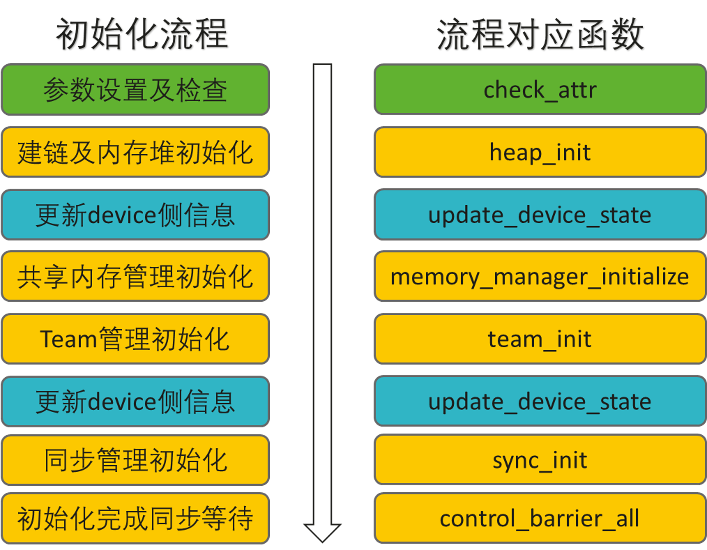
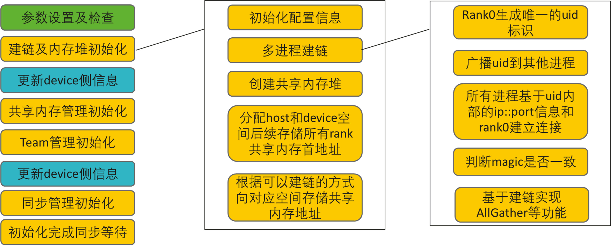
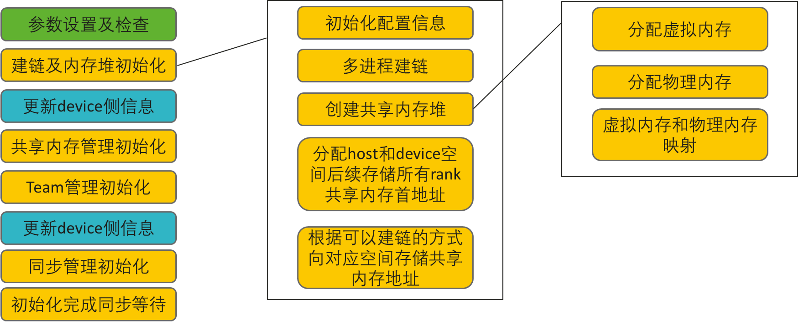
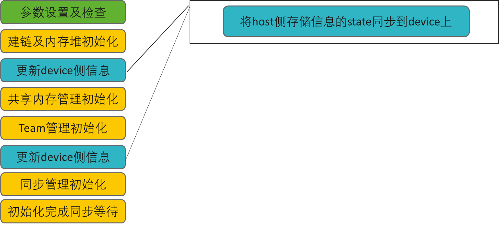
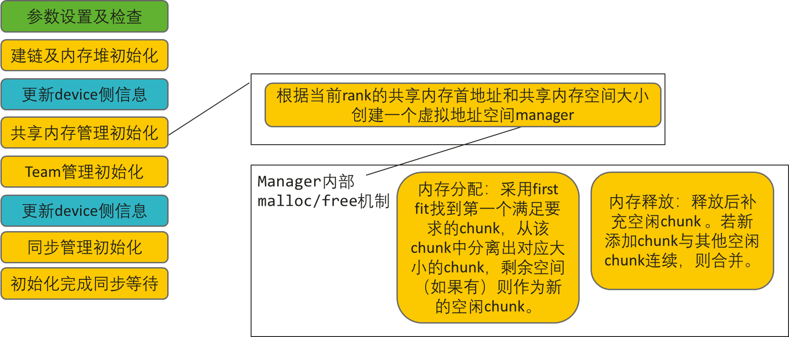
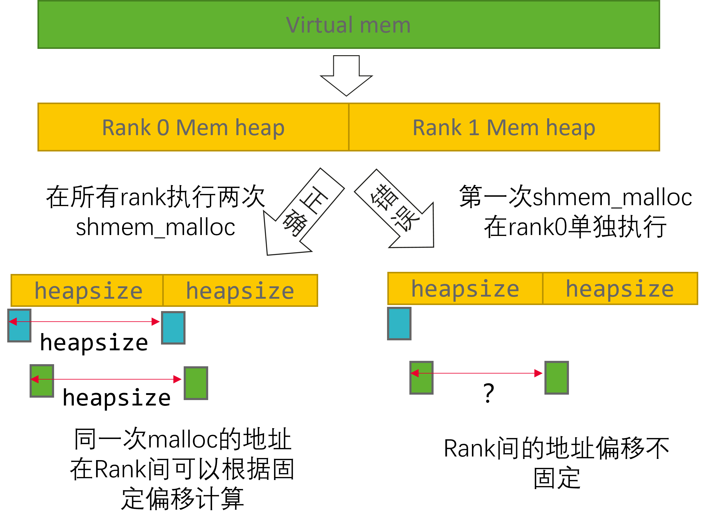
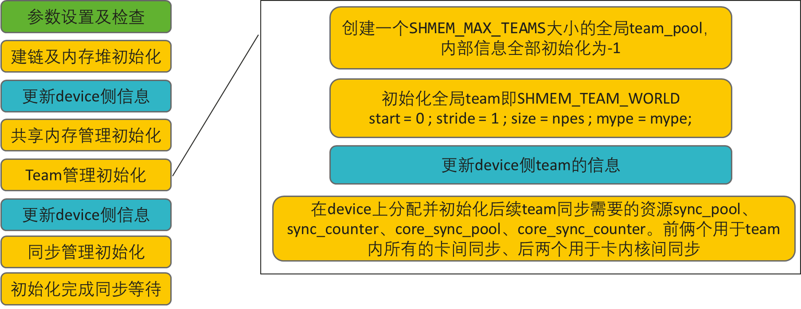
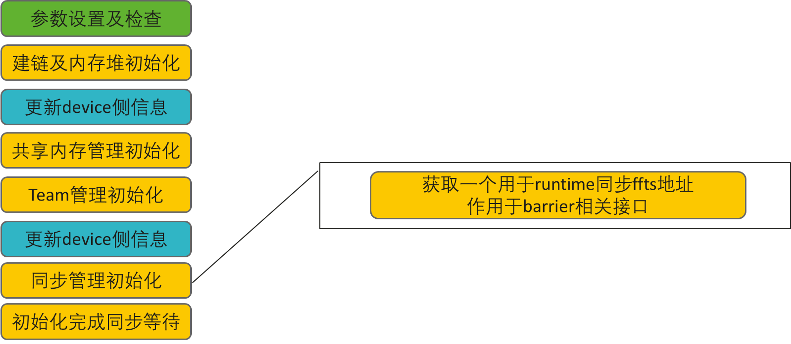
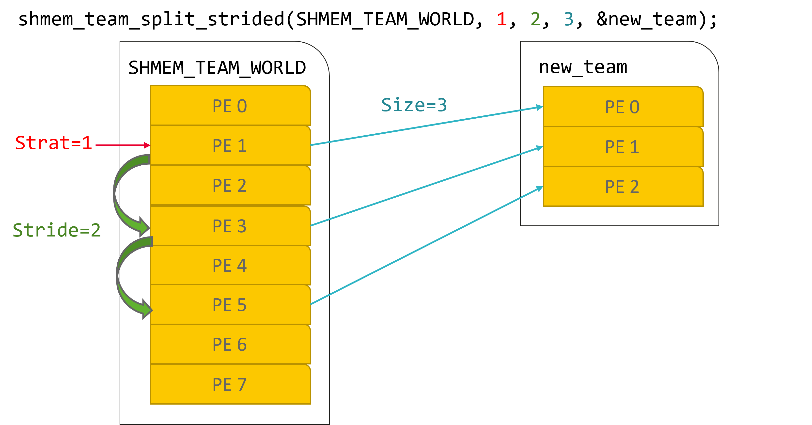

# SHMEM原理概述

## SHMEM初始化流程介绍
<p style="text-indent: 2em;">shmem的初始化接口<code>int shmem_init_attr(shmem_init_attr_t *attributes)</code>会根据传入的参数完成shmem功能所需资源的初始化。其中包含多进程间信息的同步以及建链、虚拟内存及device上物理内存的分配和映射、host和device间state信息同步以及初始化共享内存管理、team管理、同步管理功能所需要的资源。这些资源信息都会记录在一个 <code>shmemi_device_host_state_t</code> 的state里。</p>

初始化流程如下图所示，参数设置及参数校验相关内容不做具体介绍。



### 多进程间的建链
<p style="text-indent: 2em;">以uid初始化流程为例。一般会在初始化接口调用前通过torch的能力将rank0的uid信息广播到所有进程，内部包含rank0节点的ip、port、magic（通信域标识符）等信息。</p>

<p style="text-indent: 2em;">多进程间的建链是基于TCP socket实现的。所有进程会先基于uid内部的ip::port信息和rank0建立连接，连接时会根据uid内magic信息是否一致判断是否为同一通信域，不同则断开连接。连接成功后所有rank与rank0通信，基于此实现host侧的allgather和barrier等能力。（<strong>该部分能力并非shmem_barrier相关能力，而是类似于MPI_Barrier</strong>）</p>



### 内存堆的初始化
<p style="text-indent: 2em;">当前基于驱动能力实现分配虚拟内存、再分配物理内存然后实现虚拟内存和物理内存间的映射，可以在连续的虚拟地址空间管理访问共享内存地址。实际效果和流程可以参考acl接口： <a
href=https://www.hiascend.com/document/detail/zh/canncommercial/82RC1/API/appdevgapi/aclcppdevg_03_0114.html>ACL虚拟内存管理接口</a></p>



该部分会分配出两块内存：
* 用户申请的共享内存空间，每个rank申请的内存大小和初始化传入attributes的local_mem_size大小一致，后续可以通过`shmem_malloc`、`shmem_free`等共享内存接口管理。
* 用于在device保存shmem的state、team等元数据空间，当state和team等信息发生变化，进程将自动同步到元数据空间，元数据空间32M，不对外提供访问接口

### host和device间state信息同步
<p style="text-indent: 2em;">将host的state信息同步。即当host的state发生变化时将其复制一份覆盖到上个阶段分配的在device侧存储state信息的内存中，后续在device侧操作时可以直接拿到更新后的state信息。</p>



### 共享内存管理初始化
<p style="text-indent: 2em;">基于heap_base和heap_size初始化一个memory_heap用于后续共享内存管理。heap_base为当前rank的共内存首地址，heap_size为用户申请的当前rank的共享内存大小。</p>


* `shmem_malloc`内部采用first fit找到第一个满足要求的chunk，从该chunk中分离出对应大小的chunk，剩余空间（如果有）则作为新的空闲chunk。
* `shmem_free`释放后补充空闲chunk 。若新添加chunk与其他空闲chunk连续，则合并。



<p style="text-indent: 2em;"><strong>shmem_malloc和shmem_free接口使用时需要在所有进程同步调用，且需要分配或释放相同大小的内存。</strong>SHMEM内部默认shmem_malloc分配的内存在虚拟地址空间对称，即<strong>当前rank malloc的地址+heap_size=下一个rank malloc的地址</strong>。如果进程间分配内存不同会导致后续分配的内存首地址不对称，无法通过地址偏移访问到正确的数据。</p>



### team管理初始化
<p style="text-indent: 2em;">创建一个SHMEM_MAX_TEAMS大小的全局team_pool，内部信息全部初始化为-1。
初始化全局team即<code>SHMEM_TEAM_WORLD</code>，start = 0 ; stride = 1 ; size = npes ; mype = mype 即从第0个rank开始，步长为1，全局的pe数量为npes，当前pe为mype(<strong>team相关具体介绍会在team部分做详细梳理，此处仅简单展示全局team的属性信息</strong>)。</p>

<p style="text-indent: 2em;">在device上分配并初始化后续team级别同步需要的资源sync_pool、sync_counter、core_sync_pool、core_sync_counter。前俩个成员用于team内所有的卡间同步、后两个成员用于卡内核间同步。</p>


**team_pool、sync_pool、sync_counter、core_sync_pool、core_sync_counter这些信息都会在state里储存。**



### 同步管理初始化
<p style="text-indent: 2em;">该部分仅获取一个ffts地址，后续可通过<code>shmemx_get_ffts_config</code>获得，在算子内通过<code>shmemx_set_ffts_config</code>设置，用于runtime同步，AscendC层面会影响的<code>SyncAll</code>、<code>CrossCoreSetFlag</code>和<code>CrossCoreWaitFlag</code>接口，shmem层面会影响到barrier相关接口。（</ode>shmemx_set_ffts_config</code>开销较小，建议算子内都调用一次该接口）。</p>



## SHMEM通信域（Team）介绍
<p style="text-indent: 2em;">Team是shmem的通信域概念，在相关接口中可以通过`team_id`访问，初始化后会有一个默认的全局通信域，其<code>team_id</code>是<code> SHMEM_TEAM_WORLD = 0</code>。team的信息存储在在state的team_pools里，team_pools是一个shmemi_team_t的数组。shmemi_team_t内会存储当前team的id（team相关接口使用的索引）、当前进程在该team内的rank id、该team内的起始rank、rank间步长、rank数量等相关信息。</p>

**shmemi_team_t内存储的mype和size是team内部的信息，shmemi_device_host_state_t里存储的mype和npes是全局的信息。**
例如：对4个rank初始化shmem，前两卡和后两卡各为一个team。此时这四个rank的state里的mype分别是0,1,2,3。npes则都是4。但team_pools里的mype则分别是0，1，0，1。size为2。
### 子Team切分
shmem提供了专门的接口进行子Team的切分。

```c++
int shmem_team_split_strided(shmem_team_t parent_team, int pe_start, int pe_stride, int pe_size, shmem_team_t *new_team);

```
<p style="text-indent: 2em;">parent_team为父team，pe_start为起始pe，pe_stride为每次划分的步长，pe_size为划分的新team里pe的个数，new_team是出参是切分得到的新team的team_id。</p>


以初始化好8个rank的场景为例，以如下方式调用切分接口。
```c++
shmem_team_t new_team;
// 从全局通信域中idx为1的pe开始，以步长为2，切分出3个pe后停止。
auto ret = shmem_team_split_strided(SHMEM_TEAM_WORLD, 1, 2, 3, &new_team);

```
此时new_team中有3个pe在state中的mype信息分别为1,3,5，他们的team_pools里的mype信息则分别为0,1,2。



### Team的使用
<p style="text-indent: 2em;">当算子只需要在部分rank运行时就会需要用到team相关接口,如<code>shmem_team_my_pe(my_team)</code>可以返回当前rank在my_team的mype信息，<code>shmem_my_pe()</code>可以返回当前rank在全局的mype信息。通常我们可以用team级别的mype信息作为算子内部资源数组的索引，使用全局的mype作为全局共享内存地址信息的索引。</p>


<p style="text-indent: 2em;">同步接口也会使用到team_id，如shmem内部提供的team内的同步接口<code>shmem_barrier(shmem_team_t tid)</code>。</p>