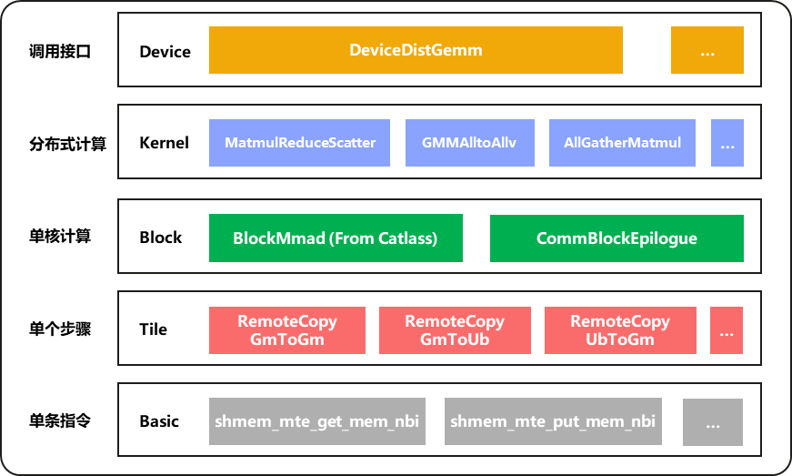

# CATCOC介绍

## 分层设计
**CATCOC延续 [CATLASS](https://gitee.com/ascend/catlass) 自上而下的分层架构，并在各个层级中新增了对远程访存的支持，从而进一步增强了系统的分层计算与通信能力。**



### 新增远程访存支持，扩展分层计算能力
- **Kernel 层**：实现支持通算融合的完整算子，将Matmul计算扩展至多卡并行计算场景。
- **Block 层**：定义了单个AICore的通信逻辑，可与Catlass中单个AICore的计算逻辑结合，实现灵活的细粒度通算融合组合。
- **Tile 层**：提供常用步骤的抽象，基于底层的基础 ASHMEM 操作构建。


## 快速使用
以matmul_reduce_scatter为例，快速使用catcoc通算融合算子：

1. **编译Shmem项目与例子**  
   在 `shmem/` 根目录下执行编译脚本：
   ```bash
   bash scripts/build.sh
   ```

2. **进入示例目录并执行运行脚本**
   ```bash
   cd examples/matmul_reduce_scatter
   bash scripts/run.sh [device_list]
   ```

   - **参数说明**：
     - `device_list`：指定用于运行的设备（NPU）编号列表，以逗号分隔。
     - 示例：使用第6和第7个NPU设备运行2卡MatMul-ReduceScatter示例：
       ```bash
       bash scripts/run.sh 6,7
       ```

   - **配置计算规模**：  
     矩阵形状参数（M、K、N）可在配置文件 `scripts/test_shapes.csv` 中进行设置。  
     修改该文件以定义测试用例的输入维度。

## 开发计算通信融合算子
以matmul_reduce_scatter为例，本节展示如何基于catcoc快速开发计算通信融合算子。

### Matmul-ReduceScatter流水示意


### 伪代码
**以下伪代码描述Matmul-ReduceScatter的内核逻辑：**

```c++
// Catcoc::DGemm::Kernel::MatmulReduceScatter, AIC部分
commLoops = (blockMatmulM * blockMatmulN) / blockPerComm
for (int block = 0; block < commLoops; block++) {
    WaitCommunicationFinish();
    // AICBlockTile循环在AICs上并行
    for (int blockInComm = 0; blockInComm < blockPerComm; blockInComm += AICBlockTile) { 
        
        // Catlass::Gemm::Block::BlockMmad: Catlass BlockMmad, 在kTile上迭代
        // BlockMmad输出到shmem
        for (int kTile = 0; kTile < blockMatmulK; kTile++) {

            // Catlass::Gemm::Tile::TileMmad
            // TileMmad使用指令Ascend::Mmad
            for (int tileMmaM = 0; tileMmaM < m; tileMmaM++) {
                for (int tileMmaN = 0; tileMmaN < n; tileMmaN++) {
                    for (int tileMmaK = 0; tileMmaK < k; tileMmaK++) {
                        mmad.call(c, a, b);
                    } // tileMmaK
                } // tileMmaN
            } // tileMmaM

        } // kTile mainloop

    } // blockInComm
    SetComputeFinish();
} // block, pipeline stages

// Catcoc::DGemm::Kernel::MatmulReduceScatter, AIV部分
commLoops = (blockMatmulM * blockMatmulN) / blockPerComm
for (int block = 0; block < commLoops; block++) {
    WaitComputeFinish();
    // matmul与communication的block shape可以不一致（通常为了性能是不一致的）
    blockPerComm = mmadBlockToCommBlock(blockPerComm);
    // AIVBlockTile循环在AIVs上并行
    for (int blockInComm = 0; blockInComm < blockPerComm; blockInComm += AIVBlockTile) { 

        // Catcoc::CommEpilogue::Block
        for (int tile = 0; tile < tileLoops; tile++) {

            // Catcoc::CommEpilogue::Tile
            // TileMmad使用指令shmem_mte_get/put_mem_nbi
            for (int tileRepeat = 0; tileRepeat < r; tileRepeat++) {
                for (int tileLength = 0; tileLength < l; tileLength++) {
                    dataCopy.call(dst, src);
                } // tileLength
            } // tileRepeat

        } // comm mainloop

    } // blockInComm
    SetCommunicationFinish();
} // block, pipeline stages
```

### 代码实现

#### 📌 整体架构图解
```
+---------------------+
| Host (CPU)          |  <-- 启动 ShmemMatmulReduceScatter
+----------+----------+
           |
           v
+---------------------------------------------------------+
| Device (Ascend NPU)                                     |
| +-------------------+    +----------------------------+ |
| | AICore (Compute)  |<-->| AIV Core (Comm)            | |
| | - BlockMmad       |    | - ReduceScatter            | |
| | - GEMM Pipeline   |    | - Cross-core Sync          | |
| +-------------------+    +----------------------------+ |
|                                                         |
| 中间缓冲区: __gm__ symmetricPtr  ← 用于跨 Rank 交换数据   |
| 输出:         __gm__ d           ← 最终累加结果          |
+---------------------------------------------------------+
```

#### 📌 新增matmul_reduce_scatter kernel
进入kernel文件夹 `cd examples\templates\include\catcoc\dgemm\kernel`，创建新kernel `matmul_reduce_scatter.hpp`

通过以下三部分实现MatmulReduceScatter内核逻辑

1. **配置头文件，定义MatmulReduceScatter类型**

``` c++
// 引入必要头文件
#include "catcoc/catcoc.h"

#include "catlass/arch/resource.hpp"
#include "catlass/arch/cross_core_sync.hpp"
#include "catlass/gemm_coord.hpp"
#include "catlass/matrix_coord.hpp"

namespace Catcoc::DGemm::Kernel {

using Catlass::MatrixCoord;
using Catlass::GemmCoord;

// 定义MatmulReduceScatter模板类
template <
    class BlockMmad_,
    class BlockEpilogueReduceScatter_,
    class BlockMmadScheduler_,
    class BlockEpilogueScheduler_,
    uint32_t WORKSPACE_STAGES_
>
class MatmulReduceScatter {
public:
    //// 使用外部传入的BlockMmad模板，用于执行核心Mmad计算
    // Block层Mmad计算类型
    using BlockMmad = BlockMmad_; 
    // 指定当前计算所针对的硬件架构标签, 用于模板特化和硬件适配
    using ArchTag = typename BlockMmad::ArchTag;
    // 定义L1缓存层级的分块形状（M, N, K），控制每个AICore上的计算粒度
    using L1TileShape = typename BlockMmad::L1TileShape;
    // 定义了矩阵A、B、C的数据类型和内存布局（layout）
    using ElementA = typename BlockMmad::ElementA;
    using LayoutA = typename BlockMmad::LayoutA;
    using ElementB = typename BlockMmad::ElementB;
    using LayoutB = typename BlockMmad::LayoutB;
    using ElementC = typename BlockMmad::ElementC;
    using LayoutC = typename BlockMmad::LayoutC;

    //// 使用外部传入的Block层通信模板，用于执行核心通信逻辑
    // Block层通信
    using BlockEpilogueReduceScatter = BlockEpilogueReduceScatter_;
    // 指定Block层通信的参数
    using BlockEpilogueReduceScatterParams = typename BlockEpilogueReduceScatter::Params;
    // 指定Block层通信输出的数据类型和内存布局
    using ElementD = typename BlockEpilogueReduceScatter::ElementDst;
    using LayoutD = typename BlockEpilogueReduceScatter::LayoutDst;

    // Block Mmad调度类型（swizzle)
    using BlockMmadScheduler = BlockMmadScheduler_;

    // Block通信调度类型（swizzle)
    using BlockEpilogueScheduler = BlockEpilogueScheduler_;

    // 计算通信流水stage
    static constexpr uint32_t WORKSPACE_STAGES = WORKSPACE_STAGES_;

    // 定义Kernel参数
    struct Params {
        GemmCoord problemShape;
        uint32_t rankIdx;
        uint32_t rankSize;

        uint32_t commInterval;

        __gm__ ElementA *ptrA;
        LayoutA layoutA;
        __gm__ ElementB *ptrB;
        LayoutB layoutB;
        __gm__ ElementD *ptrD;
        LayoutD layoutD;
        GM_ADDR ptrSymmetric;

        BlockEpilogueReduceScatterParams epilogueReduceScatter;

        CATLASS_DEVICE
        Params() = default;

        CATLASS_DEVICE
        Params(
            GemmCoord const &problemShape_, uint32_t rankIdx_, uint32_t rankSize_,
            uint32_t commInterval_,
            GM_ADDR ptrA_, LayoutA const &layoutA_,
            GM_ADDR ptrB_, LayoutB const &layoutB_,
            GM_ADDR ptrD_, LayoutD const &layoutD_,
            GM_ADDR ptrSymmetric_,
            BlockEpilogueReduceScatterParams const &epilogueReduceScatter_
        ) : problemShape(problemShape_), rankIdx(rankIdx_), rankSize(rankSize_),
            commInterval(commInterval_),
            ptrA(reinterpret_cast<__gm__ ElementA *>(ptrA_)), layoutA(layoutA_),
            ptrB(reinterpret_cast<__gm__ ElementB *>(ptrB_)), layoutB(layoutB_),
            ptrD(reinterpret_cast<__gm__ ElementD *>(ptrD_)), layoutD(layoutD_),
            ptrSymmetric(ptrSymmetric_),
            epilogueReduceScatter(epilogueReduceScatter_)
        {
        }
    };

    /**
    * 构造函数：MatmulReduceScatter
    *
    * 功能说明：
    * 初始化MatMul + ReduceScatter融合算子在AIC和AIV协同执行过程中所需的跨核同步标志（Cross-Core Flags）。
    * 在Ascend架构中，多个AIC和AIV并行执行计算与通信任务，需要通过共享标志位实现核间同步。
    * 
    * 同步机制说明：
    * - 使用双缓冲（Double Buffering）或多阶段流水（Pipelining）机制，共WORKSPACE_STAGES个阶段。
    * - 每个阶段对应一组独立的同步标志，避免读写冲突，提升并行效率。
    */
    CATLASS_DEVICE
    MatmulReduceScatter()
    {
        for (uint32_t stageIdx = 0; stageIdx < WORKSPACE_STAGES; ++stageIdx) {
            flagAicFinishStore[stageIdx] = Catlass::Arch::CrossCoreFlag(stageIdx);
            flagAivFinishCompute[stageIdx] = Catlass::Arch::CrossCoreFlag(stageIdx);
        }
    }

    template <int32_t CORE_TYPE = g_coreType>
    CATLASS_DEVICE
    void operator()(Params const &params);

private:
    Catlass::Arch::CrossCoreFlag flagAicFinishStore[WORKSPACE_STAGES];
    Catlass::Arch::CrossCoreFlag flagAivFinishCompute[WORKSPACE_STAGES];
    Catlass::Arch::Resource<ArchTag> resource;
};

}  // namespace Catcoc::DGemm::Kernel

#endif
```


2. **实现融合算子中的Matmul部分**

```c++
/**
* 模板特化：MatMul + ReduceScatter核函数中Matmul计算逻辑（AIC）实现
*
* 功能说明：
* 在每个AIC上执行局部矩阵乘法（MatMul），并将结果用于后续的ReduceScatter通信阶段。
* 支持多阶段流水（WORKSPACE_STAGES），提升吞吐
*
*/

template <>
CATLASS_DEVICE
void operator()<AscendC::AIC>(Params &params)
{
    uint32_t aicoreIdx = AscendC::GetBlockIdx();
    uint32_t aicoreNum = AscendC::GetBlockNum();

    // 每轮计算/通信中可并行执行的block数量
    // params.commInterval表示每多少个block触发一次通信（用于控制融合粒度）
    uint32_t blockPerComm = aicoreNum * params.commInterval;
    // 基于Mesh通信策略，划分每轮通信中每个rank所负责的block数
    uint32_t blockPerCommInRank = blockPerComm / params.rankSize;


    // 获取单个AICore的计算分块形状（M, N, K），来自L1缓存优化配置
    GemmCoord blockShape = L1TileShape::ToCoord();
    // 计算Scatter到每个rank上需要处理的问题规模（M方向按rankSize切分）
    GemmCoord problemShapeInRank = params.problemShape / Catlass::MakeCoord<uint32_t>(params.rankSize, 1, 1);
    // 创建MMA调度器，用于将每个rank上的计算任务划分为多个block级别的子任务，支持分块调度与边缘处理
    BlockScheduler mmadScheduler(problemShapeInRank, blockShape.GetCoordMN());
    // 计算所有rank总共需要执行的block循环次数
    // 注意：调度器仅返回单个rank任务的循环数，因此需乘以rankSize,
    // 以得到全局总block数，用于驱动完整的ReduceScatter通信流程
    uint32_t coreLoops = mmadScheduler.GetCoreLoops() * params.rankSize;
    // 计算需要进行多少轮“通信-计算”循环（即 ReduceScatter触发次数）
    uint32_t commLoops = CeilDiv(coreLoops, blockPerComm);

    // 实例化底层MMA计算模块（Matrix Multiply-Add）
    BlockMmad blockMmad(resource);

    // 定义全局内存张量（Global Memory Tensor），用于访问 HBM中的数据
    AscendC::GlobalTensor<ElementA> gmA;
    gmA.SetGlobalBuffer(reinterpret_cast<__gm__ ElementA *>(params.ptrA)); // 绑定矩阵A的全局地址
    AscendC::GlobalTensor<ElementB> gmB;
    gmB.SetGlobalBuffer(reinterpret_cast<__gm__ ElementB *>(params.ptrB)); // 绑定矩阵B的全局地址
    AscendC::GlobalTensor<ElementC> gmSymmetric;
    gmSymmetric.SetGlobalBuffer(reinterpret_cast<__gm__ ElementC *>(params.ptrSymmetric)); // 注意：这里将对称Memory绑定到gmSymmetric（用于 ReduceScatter输入）
    AscendC::GlobalTensor<ElementC> gmD;
    gmD.SetGlobalBuffer(reinterpret_cast<__gm__ ElementD *>(params.ptrD));  // 绑定矩阵D的全局地址，Matmul-ReduceScatter的全局输出

    // -----------------------------
    // 中间缓冲区布局设计（多阶段循环缓冲）
    // -----------------------------
    // 为每个stage和每个comm block定义存储空间的数据布局
    auto layoutSymmetric = Catlass::layout::RowMajor{
        WORKSPACE_STAGES * blockPerComm * L1TileShape::M,  // 总行数
        L1TileShape::N,  // 列数
        L1TileShape::N   // stride
    };

    // 逻辑形状：[stage, block_in_comm, M_per_block]
    auto layoutSymmetricRowLogicShape = Catlass::MakeCoord<int>(WORKSPACE_STAGES, blockPerComm, L1TileShape::M);
    // 使用仿射布局（Affine）实现紧凑排列，支持高效索引
    auto layoutSymmetricRow = layout::AffineRankN<3>::Packed(layoutSymmetricRowLogicShape);

    // -----------------------------
    // 主循环：按通信轮次（commIdx）执行
    // 目标：实现计算与通信的流水线重叠
    // -----------------------------
    for (uint32_t commIdx = 0; commIdx < commLoops; ++commIdx) {
        uint32_t stageId = commIdx % WORKSPACE_STAGES; // 当前使用的缓冲阶段（循环使用）

        // 从第WORKSPACE_STAGES轮次开始，需等待前一阶段的AIV（或通信线程）完成处理
        // 即：确保前一stage的ReduceScatter已完成，才能覆盖该stage的buffer
        if (commIdx >= WORKSPACE_STAGES) {
            Catlass::Arch::CrossCoreWaitFlag(flagAivFinishCompute[stageId]);
        }

        // 处理最后一轮时，实际block数可能不足
        uint32_t actualBlockPerComm = (commIdx == commLoops - 1) ?
            (coreLoops - blockPerComm * commIdx) : blockPerComm;
        uint32_t actualBlockPerCommInRank = actualBlockPerComm / params.rankSize;

        // 当前通信轮次中，每个rank内部的起始block偏移
        uint32_t commBlockOffsetInRank = commIdx * blockPerCommInRank;
        // 多AIC并行：每个AIC跳跃式分配block
        for (
            uint32_t blockIdxInComm = aicoreIdx;
            blockIdxInComm < actualBlockPerComm;
            blockIdxInComm += aicoreNum
        ) {
            // 计算当前block在rank内部的循环索引
            uint32_t loopIdxInRank = commBlockOffsetInRank + blockIdxInComm % actualBlockPerCommInRank;
            // 确定该block要分散到哪个rank（用于跨卡ReduceScatter）
            uint32_t targetRankIdx = blockIdxInComm / actualBlockPerCommInRank;
            // 调度器获取当前block的逻辑坐标（M, N, 0）
            // 注意：这个逻辑是一个rank内的
            GemmCoord blockCoord = mmadScheduler.GetBlockCoord(loopIdxInRank);
            // 获取实际的block尺寸（边缘块可能不完整）
            GemmCoord actualBlockShape = mmadScheduler.GetActualBlockShape(blockCoord);

            // 计算数据偏移量
            GemmCoord offsetCoord = blockCoord * blockShape; // 全局偏移（以block为单位）
            // A 矩阵偏移：考虑rank切分（M 方向）和rank内部的block偏移
            auto rankOffsetA = problemShapeInRank.GetCoordMK() * Catlass::MakeCoord<uint32_t>(targetRankIdx, 0);
            auto blockOffsetA = offsetCoord.GetCoordMK() + rankOffsetA;
            // B 矩阵偏移：K、N 方向
            auto blockOffsetB = offsetCoord.GetCoordKN();

            // 根据布局计算最终内存地址
            auto gmBlockA = gmA[params.layoutA.GetOffset(blockOffsetA)];
            auto gmBlockB = gmB[params.layoutB.GetOffset(blockOffsetB)];

            // 计算输出矩阵C内存地址与数据布局
            // 最终分散到当前rank的数据存储在矩阵D中
            // 最终分散到其他rank的数据存储在对称内存中，后续进行ReduceScatter操作
            AscendC::GlobalTensor<ElementC> gmBlockC;
            Catlass::layout::RowMajor layoutC;
            if (targetRankIdx == params.rankIdx) {
                MatrixCoord blockOffsetD = offsetCoord.GetCoordMN();
                gmBlockC = gmD[params.layoutD.GetOffset(blockOffsetD)];
                layoutC = params.layoutD;
            } else {
                MatrixCoord blockOffsetSymmetric = MatrixCoord{
                    layoutSymmetricRow(Catlass::MakeCoord<int>(stageId, blockIdxInComm, 0)), 0
                };
                gmBlockC = gmSymmetric[layoutSymmetric.GetOffset(blockOffsetSymmetric)];
                layoutC = layoutSymmetric;
            }

            // 执行核心 MMA 运算
            blockMmad(
                gmBlockA, params.layoutA,
                gmBlockB, params.layoutB,
                gmBlockC, layoutC,
                actualBlockShape
            );
        }

        // 当前stage的MatMul计算完成，设置标志位
        // 通知 AIV 或通信线程：可以开始ReduceScatter操作
        Catlass::Arch::CrossCoreSetFlag<0x2, PIPE_FIX>(flagAicFinishStore[stageId]);
    }
    // 所有计算和通信阶段完成后，插入全局流水线屏障
    // 确保所有AICore完成当前任务，防止后续操作提前执行
    AscendC::PipeBarrier<PIPE_ALL>();
}
```

3. **实现融合算子中的ReduceScatter部分**

```c++
/**
* 模板特化：MatMul + ReduceScatter核函数中ReduceScatter通信逻辑（AIV）实现
*
* 功能说明：
* 在 MatMul 完成后，由AIV执行ReduceScatter操作，实现：
* - 多 rank 间部分和（partial sum）的归约（Reduce）
* - 归约结果按M维度切分并分发到各rank（Scatter）
* - 与 AICore 的 MatMul 计算形成流水线，实现通算融合
*
*/
template <>
CATLASS_DEVICE
void operator()<AscendC::AIV>(Params &params)
{
    uint32_t aicoreIdx = AscendC::GetBlockIdx() / AscendC::GetSubBlockNum();
    uint32_t aicoreNum = AscendC::GetBlockNum();
    uint32_t subcoreIdx = AscendC::GetSubBlockIdx();
    // 每轮通信中处理的block数量（由 commInterval 控制）
    uint32_t blockPerComm = aicoreNum * params.commInterval;
    // 每个rank在每轮通信中的block数量（Mesh通信划分）
    uint32_t blockPerCommInRank = blockPerComm / params.rankSize;
    // 获取Matmul中单个block的MN形状
    MatrixCoord blockShapeMN = L1TileShape::ToCoordMN();
    // 每个rank会被分散到的问题规模（M方向已按rankSize切分）
    GemmCoord problemShapeInRank = params.problemShape / Catlass::MakeCoord<uint32_t>(params.rankSize, 1, 1);
    // 创建MMA调度器，用于确定block数量和block的坐标
    BlockScheduler mmadScheduler(problemShapeInRank, blockShapeMN);
    // 总block数（跨所有rank），用于控制通信轮次
    uint32_t coreLoops = mmadScheduler.GetCoreLoops() * params.rankSize;
    // 计算需要执行的通信轮次数
    auto commLoops = CeilDiv(coreLoops, blockPerComm);

    // 实例化 ReduceScatter 后处理模块
    // 负责执行远程访存操作
    ReduceScatter reduceScatter(resource, params.epilogueReduceScatter);

    // Matmul中间结果缓冲区：存储来自其他Rank的partial results
    AscendC::GlobalTensor<ElementC> gmSymmetric;
    gmSymmetric.SetGlobalBuffer(reinterpret_cast<__gm__ ElementC *>(params.ptrSymmetric));
    // -----------------------------
    // 中间结果缓冲区布局设计（多阶段循环缓冲）
    // -----------------------------
    // 为每个stage和每个comm block定义存储空间的数据布局
    auto layoutSymmetric = Catlass::layout::RowMajor(
        WORKSPACE_STAGES * blockPerComm * L1TileShape::M, L1TileShape::N,
        L1TileShape::N
    );

    // 定义输出张量 D（最终结果）的全局内存视图
    AscendC::GlobalTensor<ElementD> gmD;
    gmD.SetGlobalBuffer(reinterpret_cast<__gm__ ElementD *>(params.ptrD));

    // 获取ReduceScatter模块的通信block形状和分核策略
    MatrixCoord commBlockShape = params.epilogueReduceScatter.BlockShape();
    MatrixCoord commCoreSplit = params.epilogueReduceScatter.CoreSplit();
    // 创建通信调度器，管理跨rank的归约与分发任务
    CommScheduler commScheduler(commBlockShape, commCoreSplit);

    // -----------------------------
    // 主循环：按通信轮次（commIdx）执行ReduceScatter
    // -----------------------------
    for (uint32_t commIdx = 0; commIdx < commLoops; ++commIdx) {
        uint32_t stageId = commIdx % WORKSPACE_STAGES; // 当前使用的缓冲阶段

        // 计算本轮实际处理的block数量（最后一轮可能不足）
        uint32_t actualBlockInComm = Min(blockPerComm, coreLoops - commIdx * blockPerComm);
        // 当前通信任务的全局矩阵形状, 含分布式信息（M / rankSize, N, rankSize）
        auto actualCommShape 
            = DistMatrixCoord(actualBlockInComm * blockShapeMN.row() / params.rankSize, blockShapeMN.column(), params.rankSize);
        // 计算每个Rank的数据需要完成的通信loop次数
        MatrixCoord loopsInRank = CeilDiv(MatrixCoord(actualCommShape.GetCoordInRank()), commBlockShape);
        // 更新通信调度器的状态（动态适应不同轮次的尺寸）
        commScheduler.UpdateProblem(actualCommShape, loopsInRank);
        auto commAicoreNum = commScheduler.GetRealCore(); // 实际参与通信的AICore数
        auto commCoreLoops = commScheduler.GetCoreLoop(); // 通信侧的循环次数

        // 计算当前stage在中间缓冲区中的偏移（用于定位src数据）
        MatrixCoord stageOffset = MatrixCoord{stageId * blockPerComm, 0} * blockShapeMN;
        // 当前通信轮次对应的Mmad计算起始loop索引（在 Rank 内部）
        uint32_t mmadStartLoopIdxInComm = commIdx * blockPerCommInRank;

        // 等待AIC完成当前stage的MatMul计算
        // flagAicFinishStore[stageIdx]由AIC设置，表示数据已写入共享缓冲区
        Catlass::Arch::CrossCoreWaitFlag(flagAicFinishStore[stageId]);

        // === 全局屏障：确保所有设备上的任务都到达此点 ===
        shmemx_barrier_all_vec();
        // 设置原子操作模式：后续写入使用atomic add
        AscendC::SetAtomicAdd<ElementD>();
        AscendC::PipeBarrier<PIPE_ALL>();

        // 初始化ReduceScatter的block级循环
        reduceScatter.InitBlockLoop();

        // 仅由每个AIV的subcoreIdx == 0的线程执行通信任务
        if (subcoreIdx == 0 && aicoreIdx < commAicoreNum) {
            // 多个AIV并行通信，每个AIV跳跃式分配通信任务
            for (uint32_t commLoopIdx = aicoreIdx; commLoopIdx < commCoreLoops; commLoopIdx += commAicoreNum) {
                // 获取当前通信任务对应的block坐标（含目标 Rank）
                DistMatrixCoord commBlockCoord = commScheduler.GetBlockCoord(commLoopIdx);
                // 计算该block在params.rankIdx中的全局偏移（逻辑坐标）
                MatrixCoord blockOffset = commScheduler.GetBlockOffset(
                    DistMatrixCoord{commBlockCoord.GetCoordInRank(), params.rankIdx});
                // 该block在一个Rank内的局部偏移
                MatrixCoord blockOffsetInRank = commScheduler.GetBlockOffsetInRank(commBlockCoord.GetCoordInRank());
                // 获取实际通信block的尺寸（边缘处理）
                MatrixCoord actualCommBlockShape = commScheduler.GetActualBlockShapeByOffset(blockOffsetInRank);
                // 数据来源Rank
                uint32_t remoteRankIdx = commBlockCoord.rank();
                // 如果目标就是自己，跳过（本地已计算，无需通信）
                if (remoteRankIdx == params.rankIdx) {
                    continue;
                }

                // === 映射到原始 GEMM 的计算 loop 索引 ===
                uint32_t mmadLoopIdx = mmadStartLoopIdxInComm + blockOffsetInRank.row() / blockShapeMN.row();
                // 获取原始GEMM中该loop对应的block坐标
                GemmCoord mmadBlockCoordMNK = mmadScheduler.GetBlockCoord(mmadLoopIdx);
                MatrixCoord mmadBlockCoord = mmadBlockCoordMNK.GetCoordMN();
                MatrixCoord actualMmadBlockShape =
                    mmadScheduler.GetActualBlockShape(mmadBlockCoordMNK).GetCoordMN();

                 // 当前通信block相对于其所属GEMM block的偏移
                MatrixCoord offsetInMmadBlock = blockOffsetInRank % blockShapeMN;
                // 计算剩余空间（防止越界）
                MatrixCoord residueInMmadBlock =
                    actualMmadBlockShape - Min<uint32_t, 2>(actualMmadBlockShape, offsetInMmadBlock);
                // 计算剩余空间（防止越界）
                actualCommBlockShape = Min<uint32_t, 2>(actualCommBlockShape, residueInMmadBlock);
                
                // === 源地址：从中间缓冲区读取（带 stage 偏移）===
                auto offsetSrc = stageOffset + blockOffset;
                auto gmBlockSrc = gmSymmetric[layoutSymmetric.GetOffset(offsetSrc)];
                auto layoutBlockSrc = layoutSymmetric.GetTileLayout(actualCommBlockShape);
                
                // === 目标地址：写入最终输出 D（累加）===
                MatrixCoord mmadBlockOffset = mmadBlockCoord * blockShapeMN; // GEMM block起始
                auto offsetDst = mmadBlockOffset + offsetInMmadBlock;        // 实际写入偏移
                auto gmBlockDst = gmD[params.layoutD.GetOffset(offsetDst)];
                auto layoutBlockDst = params.layoutD.GetTileLayout(actualCommBlockShape);
                
                // === 执行远程访存操作 ===
                // 将来自remoteRankIdx的partial result累加到本地输出
                reduceScatter(
                    gmBlockSrc, layoutBlockSrc,
                    gmBlockDst, layoutBlockDst,
                    actualCommBlockShape, remoteRankIdx % params.rankSize
                );
            }
        }
        // 结束 ReduceScatter 的 block 循环
        reduceScatter.FinalizeBlockLoop();
        
        // 关闭原子操作
        AscendC::SetFlag<AscendC::HardEvent::MTE3_S>(EVENT_ID0);
        AscendC::WaitFlag<AscendC::HardEvent::MTE3_S>(EVENT_ID0);
        AscendC::SetAtomicNone();
        AscendC::PipeBarrier<PIPE_ALL>();

        // === 全局屏障：等待所有设备完成 ReduceScatter ===
        shmemx_barrier_all_vec();
        // === 通知 AIC：当前stage的通信已完成，可复用workspace ===
        Catlass::Arch::CrossCoreSetFlag<0x2, PIPE_MTE3>(flagAivFinishCompute[stageId]);
    }
}
```

#### 📌 实例化matmul_reduce_scatter kernel

创建example文件夹 `mkdir -p examples\matmul_reduce_scatter`，创建文件 `matmul_reduce_scatter.cpp`

通过以下三部分实现MatmulReduceScatter的实例化与调用逻辑

1. **配置头文件，定义输入参数解析结构体**

```c++
#include <acl/acl.h>

#include <iostream>
#include <vector>
#include <cstring>
#include <filesystem>

// from catlass
#include "catlass/catlass.hpp"
#include "catlass/arch/arch.hpp"
#include "catlass/epilogue/tile/tile_copy.hpp"
#include "catlass/epilogue/tile/tile_swizzle.hpp"
#include "catlass/gemm/block/block_mmad.hpp"
#include "catlass/gemm/block/block_swizzle.hpp"
#include "catlass/gemm/dispatch_policy.hpp"
#include "catlass/gemm/gemm_type.hpp"
#include "catlass/layout/layout.hpp"

// shmem_host
#include "host/shmem_host_def.h"
#include "host/shmem_host_heap.h"
#include "host/shmem_host_init.h"
#include "host/shmem_host_rma.h"
#include "host/shmem_host_team.h"

// utils
#include "utils.h"

#include "catcoc/catcoc.h"
#include "catcoc/comm_epilogue/comm_dispatch_policy.h"
#include "catcoc/comm_epilogue/block/comm_block_epilogue.h"
#include "catcoc/comm_epilogue/block/comm_block_swizzle.h"
#include "catcoc/comm_epilogue/tile/tile_remote_copy.h"
#include "catcoc/detail/remote_copy_type.h"
#include "catcoc/dgemm/kernel/matmul_reduce_scatter.hpp"

using namespace AscendC;
using namespace Catcoc;

constexpr size_t NPU_MALLOC_SPACE = 1024UL * 1024 * 1024;

constexpr uint32_t BLOCK_NUM = 20;

using LayoutA = Catlass::layout::RowMajor;
using LayoutB = Catlass::layout::RowMajor;
using LayoutC = Catlass::layout::RowMajor;
using LayoutD = Catlass::layout::RowMajor;

using ElementA = half;
using ElementB = half;
using ElementC = half;
using ElementD = half;

// 参数解析结构体
struct Options {
    static constexpr auto HELPER =
       "Usage: matmul_reduce_scatter rank_size rank_id ip_port m n k [device_id_list]\n";

    int rankSize;
    int rankId;
    std::string ipPort;
    uint32_t m{0};
    uint32_t n{0};
    uint32_t k{0};
    std::filesystem::path dataPath{};
    std::vector<int> deviceIdList{};

    int Parse(int argc, char **argv)
    {
        enum ArgsIndex {
            RANK_SIZE_INDEX = 1,
            RANK_ID_INDEX,
            IP_PORT_INDEX,
            M_INDEX,
            N_INDEX,
            K_INDEX,
            DATA_PATH_INDEX,
            DEVICE_LIST_INDEX,
            INDEX_MAX
        };

        if (argc > INDEX_MAX) {
            printf(HELPER);
            return -1;
        }

        rankSize = std::atoi(argv[RANK_SIZE_INDEX]);
        rankId = std::atoi(argv[RANK_ID_INDEX]);
        ipPort = argv[IP_PORT_INDEX];
        m = std::atoi(argv[M_INDEX]);
        n = std::atoi(argv[N_INDEX]);
        k = std::atoi(argv[K_INDEX]);
        dataPath = std::filesystem::path(argv[DATA_PATH_INDEX]);
        if (argc > DEVICE_LIST_INDEX) {
            char *idListStr = argv[DEVICE_LIST_INDEX];
            for (char *idToken = std::strtok(idListStr, ","); idToken; idToken = std::strtok(nullptr, ",")) {
                deviceIdList.push_back(std::atoi(idToken));
            }
        } else {
            for (size_t i = 0; i < rankSize; ++i) {
                deviceIdList.push_back(i);
            }
        }
        return 0;
    }

    std::string GetDataPath(std::string const &fileName = "") const
    {
        return (dataPath / fileName).string();
    }
};
```

2. **基于Kernel层组装算子，完成核函数**

```c++
CATLASS_GLOBAL
void ShmemMatmulReduceScatter(
    uint64_t fftsAddr,              // FFTS同步基地址
    GM_ADDR a,                      // 输入矩阵 A 的全局内存地址（__gm__ 指针）
    GM_ADDR b,                      // 输入矩阵 B 的全局内存地址
    GM_ADDR d,                      // 输出矩阵 D 的全局内存地址（本 rank 的输出分片）
    GM_ADDR symmetricPtr,           // 中间缓冲区地址，用于跨rank交换 partial results
    uint32_t m, uint32_t n, uint32_t k  // GEMM 尺寸：C = A(m×k) * B(k×n)
)
{
    // === 1. 初始化 FFTS 同步系统 ===
    AscendC::SetSyncBaseAddr(fftsAddr);

    // === 2. 指定目标硬件架构 ===
    using ArchTag = Catlass::Arch::AtlasA2;

    // === 3. 获取分布式通信上下文信息 ===
    // shmem_my_pe(): 获取当前处理单元（PE）的 rank ID（0 ~ rankSize-1）
    // shmem_n_pes(): 获取总参与通信的 PE 数量（即 world size）
    uint32_t rank = shmem_my_pe();
    uint32_t rankSize = shmem_n_pes();

    // === 4. 定义各矩阵的内存布局（Layout）===
    // 封装 GEMM 问题尺寸为 Catlass 标准结构体
    Catlass::GemmCoord problemShape{m, n, k};
    // LayoutA: 描述矩阵 A 的逻辑维度（m × k）
    LayoutA layoutA{m, k};
    // LayoutB: 描述矩阵 B 的逻辑维度（k × n）
    LayoutB layoutB{k, n};
    // LayoutD: 输出 D 被切分到 rankSize 个设备上，每个设备负责 (m/rankSize) × n
    LayoutD layoutD{m / rankSize, n};

    // === 5. 配置Block级GEMM计算核心（Matrix Multiply-Add Unit）===
    
    // 选择MMAD调度策略：基于Atlas A2的乒乓缓冲机制（Pingpong）
    constexpr bool enableUnitFlag = true;
    using MmadDispatchPolicy = Catlass::Gemm::MmadAtlasA2Pingpong<enableUnitFlag>;
    
    // L1TileShape: L1缓存中每个计算tile的大小（M=128, N=256, K=256）
    using L1TileShape = Catlass::GemmShape<128, 256, 256>;
    
    // L0TileShape: 更细粒度的向量计算单元（K 分片为 64）
    using L0TileShape = Catlass::GemmShape<128, 256, 64>;

    // 定义各矩阵的类型封装（数据类型 + 布局）
    using AType = Catlass::Gemm::GemmType<ElementA, LayoutA>;
    using BType = Catlass::Gemm::GemmType<ElementB, LayoutB>;
    using CType = Catlass::Gemm::GemmType<ElementC, LayoutC>;  // 中间累加结果类型
    using DType = Catlass::Gemm::GemmType<ElementD, LayoutD>;  // 输出结果类型

    // 实例化BlockMmad：负责在单个AICore上执行block级GEMM运算
    using BlockMmad = Catlass::Gemm::Block::BlockMmad<
        MmadDispatchPolicy,
        L1TileShape, L0TileShape,
        AType, BType, CType
    >;

    // === 6. 配置计算阶段的Block调度器 ===
    // 定义Block执行顺序为swizzle<7, 1>，swizzle策略说明参照catlass
    using BlockScheduler = typename Catlass::Gemm::Block::GemmIdentityBlockSwizzle<7, 1>;

    // === 7. 配置通信阶段的Block调度器（用于ReduceScatter）===
    // CommEpilogue::Block::BlockCommSwizzle<0, true>
    // 0 表示调度顺序，IsDeterministic=true表示启用确定性计算
    constexpr bool IsDeterministic = true;
    using CommBlockScheduler = CommEpilogue::Block::BlockCommSwizzle<0, IsDeterministic>;

    // === 8. 配置Block级通信核心（ReduceScatter） ===
    // ReduceScatter Block内数据搬运使用的缓冲区stage数（双缓冲）
    constexpr uint32_t UB_STAGES = 2;
    // 通信后端调度策略：基于Atlas A2的远程拷贝，模式为 Scatter
    using ReduceScatterDispatch = CommEpilogue::EpilogueAtlasA2CommRemoteCopy<UB_STAGES,
        Catcoc::detail::CopyMode::Scatter>;

    using CommBlockShape = Catlass::MatrixShape<64, 256>;   // 每次通信的block大小
    using CommCoreSplit = Catlass::MatrixShape<20, 1>;      // 每个通信任务分配的核心数（20个core负责数据维）
    using ReduceScatterTileShape = Catlass::MatrixShape<32, 256>;   // 一个通信block内部的通信搬运指令粒度
    
    // 定义远端搬运的类型封装和搬运模式
    using RemoteSrcType = CType; // RemoteSrcType: 源数据类型（中间partial result）
    using RemoteDstType = DType; // RemoteDstType: 目标数据类型（输出 D 类型）
    using CopyDirect = Catcoc::detail::CopyDirect;  // CopyDirect::Get 表示使用“拉取（pull）”模式进行远程读取
    using TileRemoteCopy = CommEpilogue::Tile::TileRemoteCopy<ArchTag, RemoteSrcType, RemoteDstType, CopyDirect::Get>; // TileRemoteCopy: 实现跨设备tile级别的远程数据读取
    using TileScheduler = Catlass::Epilogue::Tile::EpilogueIdentityTileSwizzle; // TileScheduler: tile级别的调度策略
    
    // 实例化Block级的ReduceScatter Epilogue
    using BlockEpilogueReduceScatter = CommEpilogue::Block::CommBlockEpilogue<
        ReduceScatterDispatch,
        RemoteSrcType, RemoteDstType,
        CommCoreSplit,
        CommBlockShape,
        ReduceScatterTileShape, TileRemoteCopy, TileScheduler
    >;

    // === 9. 配置主核函数（MatmulReduceScatterKernel）===
    constexpr uint32_t WORKSPACE_STAGES = 2;  // 多阶段流水线（双缓冲）
    constexpr uint32_t COMM_INTERVAL = 10; // 每10个block进行一次通信

    // 主核函数模板：集成计算（BlockMmad）与通信（BlockEpilogueReduceScatter）
    using MatmulReduceScatterKernel = DGemm::Kernel::MatmulReduceScatter<
        BlockMmad,
        BlockEpilogueReduceScatter,
        BlockScheduler,
        CommBlockScheduler,
        WORKSPACE_STAGES
    >;

    // === 10. 构造主核函数所需的所有参数 ===
    // 构造ReduceScatter参数对象
    typename BlockEpilogueReduceScatter::Params reduceScatterParams{};

    typename MatmulReduceScatterKernel::Params params{
        problemShape,           // GEMM 问题尺寸 (M,N,K)
        rank, rankSize,         // 当前 Rank ID 和总数量
        COMM_INTERVAL,          // 通信间隔（控制流水线节奏）
        a, layoutA,             // A 矩阵指针 + 布局
        b, layoutB,             // B 矩阵指针 + 布局
        d, layoutD,             // 输出 D 指针 + 布局
        symmetricPtr,           // 中间缓冲区指针（用于存储其他Rank的partial result）
        reduceScatterParams     // ReduceScatter 专用参数
    };

    // === 11. 实例化核函数并执行 ===
    MatmulReduceScatterKernel matmulReduceScatterKernel;
    matmulReduceScatterKernel(params);  // 执行算子
}
```

3. **编写main函数，完成数据内存申请等初始化工作，并启动算子**

```c++
int main(int argc, char **argv)
{
    int status = SHMEM_SUCCESS;
    Options options;
    if (options.Parse(argc, argv) != 0) {
        std::cerr << "Invalid arguments\n";
        return 1;
    }
    int rankSize = options.rankSize;
    int rankId = options.rankId;
    std::string ipPort = options.ipPort;
    uint32_t m = options.m;
    uint32_t n = options.n;
    uint32_t k = options.k;
    int32_t deviceId = options.deviceIdList[rankId];

    std::cout << "[TEST] input rank_size: " << rankSize << " rank_id:" << rankId << " input_ip: " << ipPort << "\n";

    aclrtStream stream = nullptr;
    ACL_CHECK(aclInit(nullptr));
    ACL_CHECK(aclrtSetDevice(deviceId));
    ACL_CHECK(aclrtCreateStream(&stream));
    shmem_init_attr_t *attributes;
    status = shmem_set_attr(rankId, rankSize, NPU_MALLOC_SPACE, ipPort.c_str(), &attributes);
    status = shmem_init_attr(attributes);
    status = shmem_init_status();

    size_t aSize = static_cast<size_t>(m) * k * sizeof(__fp16);
    size_t bSize = static_cast<size_t>(k) * n * sizeof(__fp16);
    size_t dSize = static_cast<size_t>(m) * n * sizeof(__fp16);
    size_t dSizeScatter = dSize / options.rankSize;

    uint8_t *aDevice;
    ACL_CHECK(aclrtMalloc((void **)(&aDevice), aSize, ACL_MEM_MALLOC_HUGE_FIRST));
    uint8_t *aHost;
    ACL_CHECK(aclrtMallocHost((void **)(&aHost), aSize));
    ReadFile(options.GetDataPath("rank_" + std::to_string(rankId) + "_a.bin"), aHost, aSize);
    ACL_CHECK(aclrtMemcpy(aDevice, aSize, aHost, aSize, ACL_MEMCPY_HOST_TO_DEVICE));

    uint8_t *bDevice;
    ACL_CHECK(aclrtMalloc((void **)(&bDevice), bSize, ACL_MEM_MALLOC_HUGE_FIRST));
    uint8_t *bHost;
    ACL_CHECK(aclrtMallocHost((void **)(&bHost), bSize));
    ReadFile(options.GetDataPath("rank_" + std::to_string(rankId) + "_b.bin"), bHost, bSize);
    ACL_CHECK(aclrtMemcpy(bDevice, bSize, bHost, bSize, ACL_MEMCPY_HOST_TO_DEVICE));

    uint8_t *dDevice;
    ACL_CHECK(aclrtMalloc((void **)(&dDevice), dSizeScatter, ACL_MEM_MALLOC_HUGE_FIRST));
    uint8_t *dHost;
    ACL_CHECK(aclrtMallocHost((void **)(&dHost), dSize));

    void *symmPtr = shmem_malloc((204 * 1024 * 1024) * sizeof(__fp16));
    uint8_t *symmetricPtr = reinterpret_cast<uint8_t *>(symmPtr);

    ACL_CHECK(aclrtSynchronizeStream(stream));
    std::cout << "Before calling MM_RS kernel " << std::endl;
    for (int i = 0; i < 1; i++) {
        ShmemMatmulReduceScatter<<<BLOCK_NUM, nullptr, stream>>>(
            shmemx_get_ffts_config(),
            aDevice, bDevice, dDevice, symmetricPtr,
            m, n, k
        );
    }
    ACL_CHECK(aclrtSynchronizeStream(stream));
    std::cout << "After calling MM_RS kernel " << std::endl;

    ACL_CHECK(aclrtMemcpy(dHost, dSizeScatter, dDevice, dSizeScatter, ACL_MEMCPY_DEVICE_TO_HOST));
    WriteFile(options.GetDataPath("shmem_output.bin"), dHost, dSizeScatter, rankId * dSizeScatter);
    if (rankId == 0) {
        std::printf("test finished\n");
    }

    shmem_free(symmPtr);

    ACL_CHECK(aclrtFreeHost(aHost));
    ACL_CHECK(aclrtFreeHost(bHost));
    ACL_CHECK(aclrtFreeHost(dHost));
    ACL_CHECK(aclrtFree(aDevice));
    ACL_CHECK(aclrtFree(bDevice));
    ACL_CHECK(aclrtFree(dDevice));

    std::cout << "[TEST] begin to exit...... rankId: " << rankId << std::endl;
    status = shmem_finalize();
    ACL_CHECK(aclrtDestroyStream(stream));
    ACL_CHECK(aclrtResetDevice(deviceId));
    ACL_CHECK(aclFinalize());

    return 0;
}
```

# 版权声明
Copyright (c) 2025 Huawei Technologies Co., Ltd.

This file is a part of the CANN Open Software. Licensed under CANN Open Software License Agreement Version 1.0 (the "License"). Please refer to the License for details. You may not use this file except in compliance with the License.

THIS SOFTWARE IS PROVIDED ON AN "AS IS" BASIS, WITHOUT WARRANTIES OF ANY KIND, EITHER EXPRESS OR IMPLIED, INCLUDING BUT NOT LIMITED TO NON-INFRINGEMENT, MERCHANTABILITY, OR FITNESS FOR A PARTICULAR PURPOSE. See LICENSE in the root of the software repository for the full text of the License.