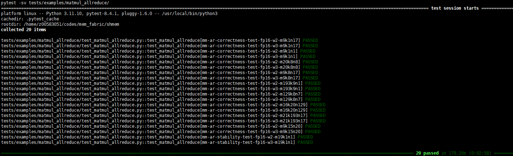

# 算子泛化性测试框架说明

## 1. 简介
本测试框架旨在为 `Shmem` 系列内核提供一个基于 `pytest` 的自动化、可扩展的泛化精度测试环境。框架的核心是通过随机生成覆盖各种数据类型、张量形状和数值分布的测试用例，调用C++内核执行计算，并与 `numpy` 在CPU上计算的真值进行对比，以验证内核的正确性和精度。

## 2. 框架结构
```
tests/examples/
├── config.py # 全局测试配置文件
├── utils.py # 通用工具函数（动态误差计算等）
├── np_uniform_generator.py # 均匀分布随机数生成器
├── np_normal_generator.py # 正态分布随机数生成器
├── matmul_allreduce/
│ ├── test_fusion_matmul_allreduce.py # matmul_allreduce 内核的 pytest 测试脚本
│ └── test_data/ # 持久化的测试数据缓存目录
├── readme.md # 本文档
└── ... # 其他内核的测试目录
```
-   `config.py`: 定义了整个测试框架的通用配置，如张量形状约束、数值分布参数、数据类型、精度阈值等。
-   `utils.py`: 包含通用工具函数，特别是 `get_rtol()` 函数，用于根据数据类型和计算量动态计算误差阈值。
-   `np_uniform_generator.py` / `np_normal_generator.py`: 分别用于生成均匀分布和正态分布的测试数据。
-   `<kernel_name>/test_<kernel_name>.py`: 针对特定内核的测试脚本。
-   `<kernel_name>/test_data/`: 用于存储生成的测试数据，以备调试和分析。

## 3. 核心逻辑

测试脚本 (`test_fusion_matmul_allreduce.py`) 的执行流程如下：

### 3.1. 测试用例生成
-   **参数组合与分类**: `get_test_cases` 函数会生成两类测试用例：
    -   **正确性 (`correctness`) 测试**: 用于验证基本功能，输入数据范围较小。
    -   **数值稳定性 (`stability`) 测试**: 用于验证在极端或特殊数值下的表现，输入数据更复杂。
    该函数根据 `config.py` 中定义的参数（如数据类型、`rank`数量、各类测试用例数）生成一系列 `pytest.param`，用于驱动测试。
-   **形状生成**: `generate_shapes` 函数根据 `config.py` 中的约束（如 `SHAPE_DIM_VALUES`, `SHAPE_DIM_RANDOM_RANGE` 等）随机生成合法的张量形状。

### 3.2. 数据与真值生成
-   **张量生成**:
    -   对于 **正确性** 测试，使用 `NPUniformGenerator` 在一个预设的、较小的范围内生成均匀分布的张量。
    -   对于 **数值稳定性** 测试，使用 `NPNormalGenerator` 生成符合正态分布的张量，可能包含更具挑战性的数值。
-   **真值计算**: 在 CPU 端使用 `numpy` 计算真值。为了保证精度，中间累加过程在 `fp32` 下进行，最后再转换到目标精度。
-   **溢出处理**: 在生成真值后，会检查是否存在 `inf` 或 `NaN`。如果存在，会通过 `pytest.skip()` 跳过当前测试用例，避免因输入数据本身导致的问题而标记测试为失败。

### 3.3. 数据持久化
-   为每个测试用例的参数组合计算一个唯一的MD5哈希值。
-   以该哈希值创建一个目录（位于 `test_data/<hash_value>`），并将该测试用例的所有输入张量（`rank_<i>_a.bin`, `rank_<i>_b.bin`）保存到此目录中。这便于后续的复现和调试。

### 3.4. C++ 内核执行
-   使用 Python 的 `multiprocessing` 模块，为每个 `rank` 创建一个独立的进程。
-   每个进程会调用预编译的 C++ 可执行文件 (`EXECUTABLE_PATH`)。
-   测试所需的参数，包括 `rank`、`world_size`、网络地址以及**数据持久化目录的路径**，都会通过命令行参数传递给 C++ 程序。
-   C++ 程序从指定的数据目录中读取输入，并将计算结果 `shmem_output.bin` 写回到同一目录。

### 3.5. 结果验证
-   所有 C++ 进程执行完毕后，主进程会从数据目录中读取 `shmem_output.bin`。
-   **动态精度验证**:
    1.  **计算操作量**: 根据 `m, k, n, world_size` 计算出总的浮点运算次数。
    2.  **获取容忍度**: 调用 `utils.py` 中的 `get_rtol()` 函数，传入数据类型和操作量，获得一个动态计算出的误差容忍度 `err`。
    3.  **双重标准验证**:
        -   对真值中绝对值大于等于 `1.0` 的部分，进行 **相对误差** 比较 (`|act - gt| / |gt| <= err`)。
        -   对真值中绝对值小于 `1.0` 的部分，进行 **绝对误差** 比较 (`|act - gt| <= err`)。

## 4. 如何运行测试
1.  **编译核函数**: 确保目标核函数的 C++ 可执行文件已经编译。例如，对于 `matmul_allreduce`，需要先执行：
    ```bash
    bash examples/matmul_allreduce/scripts/build.sh
    ```
2.  **设置可执行文件路径**: 在 `test_fusion_matmul_allreduce.py` 脚本的顶部，确认 `EXECUTABLE_PATH` 变量指向了正确的 C++ 可执行文件路径。
3.  **运行 Pytest**: 在项目根目录下，直接运行 `pytest` 命令。
    ```bash
    export LD_LIBRARY_PATH=<path_to_shmem_lib>:<path_to_memfabric_hybrid_lib>:$LD_LIBRARY_PATH
    pytest -sv tests/examples/matmul_allreduce/
    ```
    *请将 `<path_to_...>` 替换为实际的库路径。*

4. **输出示例** <br/>

<br/>说明：带“correctness"的用例是正确性测试用例，带”stability"是用例是数值稳定性测试用例。


## 5. 如何扩展
要为新的内核（例如 `allgather`）添加测试，可以遵循以下步骤：
1.  在 `tests/examples/` 目录下创建一个新的子目录，例如 `allgather`。
2.  在该目录中创建一个新的测试脚本，例如 `test_allgather.py`。
3.  参考 `test_matmul_allreduce.py` 的结构，实现新内核的测试逻辑：
    -   实现数据生成逻辑（可复用 `NP*Generator` 或创建新的生成器）和真值计算。
    -   实现调用 C++ 内核的辅助函数。
    -   实现结果验证逻辑，可复用 `get_rtol` 和双重标准验证方法。
4.  如果需要新的通用配置，可以将其添加到 `tests/examples/config.py` 中。